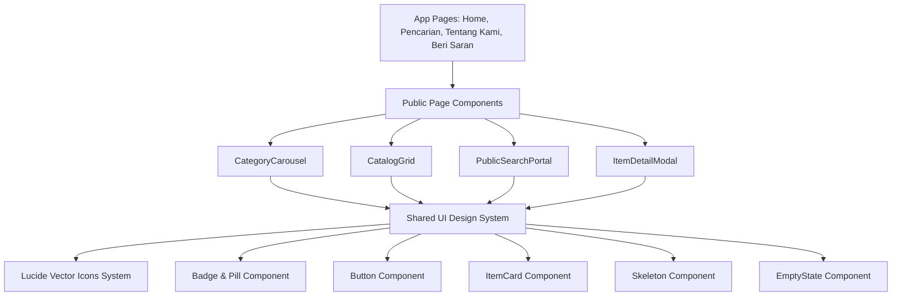

# Rencana Peningkatan UI Publik LACAK & Pembentukan Design System Reusable

Dokumen ini berisi analisis, rekomendasi arsitektur UI, dan rencana aksi untuk meningkatkan tampilan Halaman Publik **LACAK-V1** agar berstandar profesional, memiliki ciri khas (brand identity), serta tersusun dari komponen yang sepenuhnya *reusable* sebelum nantinya digunakan untuk merombak UI Halaman Petugas.

---

## 1. Tanggapan & Analisis Strategi UI

### 💡 Mengapa Keputusan Anda Sangat Tepat?
1. **Konsistensi UI adalah Standar Aplikasi Profesional (Enterprise-grade)**: 
   Dalam dunia industri software modern, aplikasi tidak boleh memiliki "kepribadian ganda" di mana UI publik dan UI internal/petugas saling bertolak belakang. Konsistensi visual (warna, tipografi, bentuk button, card, modal, dan ikon) menciptakan rasa percaya (*trust*) dan kemudahan penggunaan (*usability*).
2. **Halaman Publik Sebagai Anchor (Wajah Utama)**: 
   Memilih UI Publik sebagai acuan utama adalah langkah terbaik karena Halaman Publik adalah *first impression* bagi pengguna/warga BAZMA. 
3. **Efisiensi Pengembangan melalui Reusable UI Components**: 
   Dengan membenahkan UI Publik terlebih dahulu hingga memiliki *Design System* (Komponen Reusable), perombakan UI Petugas di fase berikutnya akan menjadi jauh lebih cepat dan rapi karena Petugas tinggal meng-import komponen UI yang sudah teruji di Halaman Publik.

---

## 2. Hasil Analisis Kelemahan UI Publik Saat Ini & Area Perbaikan

| Area UI | Kondisi Saat Ini | Masalah / Kekurangan | Solusi & Peningkatan |
|---|---|---|---|
| **Ikon Kategori** | Menggunakan Emoji bawaan OS (`🎧`, `💻`, `🎒`, `🧥`, `🌧️`) | • Tampilan tidak konsisten di Windows, Android, iOS, macOS. • Terkesan kasual/informal dan kurang berwibawa. • Tidak memiliki ciri khas warna brand LACAK. | Mengganti seluruh emoji dengan set **Vector Icons (`lucide-react`)** yang dikustomisasi dengan aksen warna brand LACAK (Teal/Emerald `#0d7565`). Ikon tajam, seragam, retina-ready, & berkesan modern. |
| **Komponen UI** | Komponen UI tersebar dan di-style ad-hoc di masing-masing file | • Kode styling berulang di beberapa tempat. • Sulit di-reuse ke Halaman Petugas secara langsung. | Membangun **Atomic UI Component Library** di `src/components/ui/` (`Button`, `Badge`, `Card`, `CategoryPill`, `Modal`, `Input`, `Select`, `EmptyState`, `SkeletonLoader`). |
| **Identity & Visual Polish** | Penggunaan warna & shadow belum sepenuhnya terstruktur | • Belum ada token warna & mikro-interaksi yang seragam. • Aksen brand LACAK belum terpancar kuat. | Menyusun *Design Tokens* untuk warna Teal LACAK (`#0d7565`, `#158a76`, `#064e43`, `#eaf6f2`), border-radius (rounded-xl/2xl), glassmorphism, dan efek hover lift yang responsif. |
| **Card Barang & Grid** | Card item menggunakan layout standar | • Badging status & lokasi masih terpisah style-nya. • Image loading belum ada skeleton loader. | Redesign **Item Card** dengan badge status (Tersedia / Diambil) bernuansa modern, hover-zoom image, dan skeleton loading yang mulus. |
| **Carousel Kategori** | Scroll manual standar | • Tampilan card kategori belum mencolok secara visual. • Ikon emoji terlihat tenggelam. | Menjadikan `CategoryCarousel` lebih *high-end* dengan ikon Lucide yang memiliki latar lingkaran bergradasi teal, indikator aktif bernyawa, dan hover elevation. |
| **Navbar & Search Hero** | Navigasi & filter dropdown bawaan HTML `<select>` | • Dropdown `<select>` bawaan browser terlihat kaku. • Filter bar terasa belum seirama dengan banner. | Merapikan `PublicNavbar` & `PublicSearchPortal` dengan visual pill yang sleek, responsive drawer pada mobile, dan animasi filter reset. |

---

## 3. Rencana Rinci Peningkatan UI Publik (Fase 1)

### Component Architecture

### Proposed Changes

#### [NEW] Dependency & Icons Setup
- Installing `lucide-react` untuk menyediakan ratusan ikon vektor berkualitas tinggi yang dapat disesuaikan warnanya dengan stroke presisi.

#### [NEW] Design System Components (`src/components/ui/`)
- **[NEW] [`CategoryIcon.tsx`](file:///c:/Users/pcbaz/Desktop/Muhammad-Choerul-Akbar/MAPEL/SAAS/Kelas%2012/Praktik/lacak-project/lacak-v1/src/components/ui/CategoryIcon.tsx)**: Pemetaan nama kategori ke ikon Lucide SVG profesional (`Headphones`, `Laptop`, `Smartphone`, `Briefcase`, `Key`, `Watch`, `Shirt`, `Glasses`, `BookOpen`, `Package`, dll.) lengkap dengan opsi size dan styling.
- **[NEW] [`Badge.tsx`](file:///c:/Users/pcbaz/Desktop/Muhammad-Choerul-Akbar/MAPEL/SAAS/Kelas%2012/Praktik/lacak-project/lacak-v1/src/components/ui/Badge.tsx)**: Komponen badge status (Tersedia, Diambil, Diproses) dan badge kategori yang konsisten.
- **[NEW] [`Button.tsx`](file:///c:/Users/pcbaz/Desktop/Muhammad-Choerul-Akbar/MAPEL/SAAS/Kelas%2012/Praktik/lacak-project/lacak-v1/src/components/ui/Button.tsx)**: Komponen tombol standar dengan varian primary, secondary, outline, ghost, serta dukungan ikon & loading spinner.
- **[NEW] [`ItemCard.tsx`](file:///c:/Users/pcbaz/Desktop/Muhammad-Choerul-Akbar/MAPEL/SAAS/Kelas%2012/Praktik/lacak-project/lacak-v1/src/components/ui/ItemCard.tsx)**: Card barang temuan yang dipisahkan dari `CatalogGrid` agar bisa di-reuse di mana saja (termasuk di Halaman Petugas).
- **[NEW] [`SkeletonItem.tsx`](file:///c:/Users/pcbaz/Desktop/Muhammad-Choerul-Akbar/MAPEL/SAAS/Kelas%2012/Praktik/lacak-project/lacak-v1/src/components/ui/SkeletonItem.tsx)**: Component skeleton loading saat data sedang dimuat.

#### [MODIFY] Public Components & Pages
- **[MODIFY] [`public-utils.ts`](file:///c:/Users/pcbaz/Desktop/Muhammad-Choerul-Akbar/MAPEL/SAAS/Kelas%2012/Praktik/lacak-project/lacak-v1/src/components/public/public-utils.ts)**: Memperbarui fungsi `getCategoryIcon` untuk mengembalikan nama ikon Lucide atau komponen ikon vektor alih-alih emoji string.
- **[MODIFY] [`CategoryCarousel.tsx`](file:///c:/Users/pcbaz/Desktop/Muhammad-Choerul-Akbar/MAPEL/SAAS/Kelas%2012/Praktik/lacak-project/lacak-v1/src/components/public/CategoryCarousel.tsx)**: Mengganti tampilan emoji dengan `CategoryIcon` SVG vector, mempercantik kartu kategori dengan hover glow Teal, indikator aktif ring 2px, dan navigasi panah yang lebih mulus.
- **[MODIFY] [`CatalogGrid.tsx`](file:///c:/Users/pcbaz/Desktop/Muhammad-Choerul-Akbar/MAPEL/SAAS/Kelas%2012/Praktik/lacak-project/lacak-v1/src/components/public/CatalogGrid.tsx)**: Menggunakan `ItemCard` reusable, mempercantik tampilan pagination, dan mempoles empty state jika tidak ada barang yang ditemukan.
- **[MODIFY] [`PublicSearchPortal.tsx`](file:///c:/Users/pcbaz/Desktop/Muhammad-Choerul-Akbar/MAPEL/SAAS/Kelas%2012/Praktik/lacak-project/lacak-v1/src/components/public/PublicSearchPortal.tsx)** & **[`PublicNavbar.tsx`](file:///c:/Users/pcbaz/Desktop/Muhammad-Choerul-Akbar/MAPEL/SAAS/Kelas%2012/Praktik/lacak-project/lacak-v1/src/components/public/PublicNavbar.tsx)**: Penyempurnaan styling bar pencarian, penyesuaian dropdown filter, serta pembaruan ikon tombol action.
- **[MODIFY] [`ItemDetailModal.tsx`](file:///c:/Users/pcbaz/Desktop/Muhammad-Choerul-Akbar/MAPEL/SAAS/Kelas%2012/Praktik/lacak-project/lacak-v1/src/components/public/ItemDetailModal.tsx)**: Mempercantik modal detail barang publik dengan badge baru, tombol klaim/kontak petugas yang tegas, dan visual image viewer yang jernih.

---

## 4. Roadmap Penyelarasan Halaman Petugas (Fase 2 - Mendatang)

Setelah UI Publik 100% matang, profesional, dan reusable:
1. **Dashboard Petugas (`/dashboard`)**: Mengadopsi palet warna Teal & komponen `Card`, `Badge`, `Button` dari Design System Publik.
2. **Tabel Manajemen Barang (`/data-warga`, `/taruh`, `/ambil`, `/riwayat`)**: Menggunakan `CategoryIcon` dan `Badge` yang persis sama dengan Halaman Publik sehingga tidak ada disonansi visual saat petugas bekerja.
3. **Form Lapor & Penyerahan**: Menggunakan komponen input & modal dari UI Publik.

---

## 5. Verification Plan

### Manual Verification
- Melakukan verifikasi visual di browser (menggunakan browser subagent atau preview local dev) pada Halaman Publik (`/`, `/pencarian`, `/tentang-kami`, `/beri-saran`).
- Memastikan semua kategori di `CategoryCarousel` tampil dengan ikon Lucide SVG yang presisi (tidak ada emoji yang tersisa).
- Menguji interaksi filter (pencarian, pilih kategori, reset filter, klik detail item modal) untuk memastikan performa dan transisi berjalan mulus.
